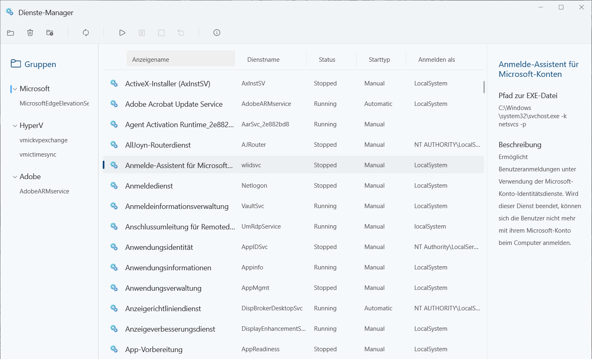
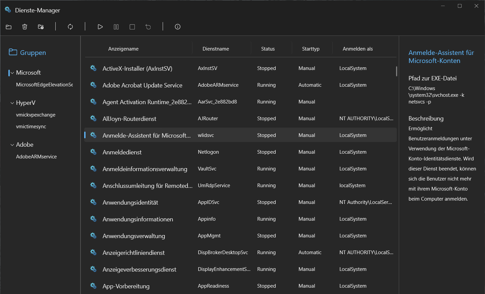

# Service-Manager

## Description
I started developing this application a few days ago. It is supposed to be a modern version of the existing Service Manager in Windows. New functions are to accompany the refreshed look.

The application is based on WinUI 3.

## Goals
The primary goal is to package the functions of the existing system application in a modern look. This includes better usability and a dark design.

Furthermore, it should be possible to assign the services to groups. This should make it possible to quickly stop and start services that belong together in a graphical user interface.

Filtering should be possible on the basis of the groups in order to quickly have the most important things in view.

## Screenshots

